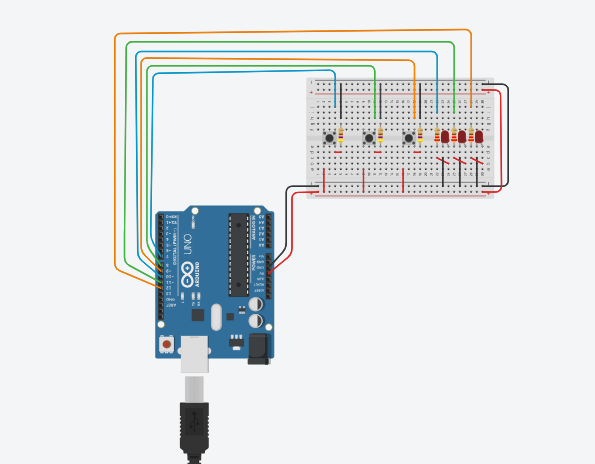

# Arduino circuit

---

## Project Title  
**Design of a 3-Button LED Control Circuit in Tinkercad**

---

## Objective  
The goal of this project is to design a digital input/output control system using Tinkercad, in which **three push buttons** are used to control **three LEDs** via an Arduino Uno. The simulation demonstrates basic microcontroller I/O operations, where pressing a button turns on a specific LED and turns off the others.

---

## Description  
The circuit is built using three buttons and three LEDs connected to an Arduino:

- **Button 1** (Pin 7) controls **LED 1** (Pin 10)  
- **Button 2** (Pin 8) controls **LED 2** (Pin 11)  
- **Button 3** (Pin 9) controls **LED 3** (Pin 12)

Each button is connected. When a button is pressed, its corresponding LED turns on while the other two LEDs are turned off. This ensures that **only one LED is active at a time**, based on the last button pressed.

A heartbeat LED is also added on pin 13, which blinks periodically to indicate that the microcontroller is running.

---

## Tools and Platform  
- **Platform**: [Tinkercad Circuits](https://www.tinkercad.com) (by Autodesk)  
- **Microcontroller**: Arduino Uno  
- **Components Used**:
  - Push Buttons ×3  
  - LEDs ×3  
  - 470Ω Resistors ×3
  - 220Ω Resistors ×3
  - Breadboard  
  - Wires

---
## Arduino Code

```cpp

#define Pressed   LOW
#define Released  HIGH

#define LEDon     LOW
#define LEDoff    HIGH

const byte buttons[] = {7, 8, 9};
const byte leds[]    = {10, 11, 12};
const byte heartBeatLED = 13;

byte lastButtonStates[3];

unsigned long heartBeatMillis = 0;
unsigned long switchMillis = 0;

void setup() {
  for (byte i = 0; i < 3; i++) {
    pinMode(buttons[i], INPUT_PULLUP);
    pinMode(leds[i], OUTPUT);
    digitalWrite(leds[i], LEDon);
  }

  pinMode(heartBeatLED, OUTPUT);
}

void loop() {
  heartBeat();

  if (millis() - switchMillis >= 1ul) {
    switchMillis = millis();

    if (checkSwitch(0)) {
      digitalWrite(leds[0], !digitalRead(leds[0]));
    }

    if (checkSwitch(1)) {
      digitalWrite(leds[0], !digitalRead(leds[0]));
      digitalWrite(leds[1], !digitalRead(leds[1]));
    }

    if (checkSwitch(2)) {
      digitalWrite(leds[1], !digitalRead(leds[1]));
      digitalWrite(leds[2], !digitalRead(leds[2]));
    }
  }
}

void heartBeat() {
  if (millis() - heartBeatMillis >= 700ul) {
    heartBeatMillis = millis();
    digitalWrite(heartBeatLED, !digitalRead(heartBeatLED));
  }
}

bool checkSwitch(byte index) {
  byte currentState = digitalRead(buttons[index]);
  if (currentState != lastButtonStates[index]) {
    lastButtonStates[index] = currentState;
    if (currentState == Pressed) {
      return true;
    }
  }
  return false;
}

```
---

## Project Screenshot  
Below is a screenshot of the final 3-button LED control circuit created in Tinkercad:

)

---

## Created By  
- **Name**: Aghadi Saleh Al-rebdi   
- **Department**: Computer Science  
- **Year**: 2025  

